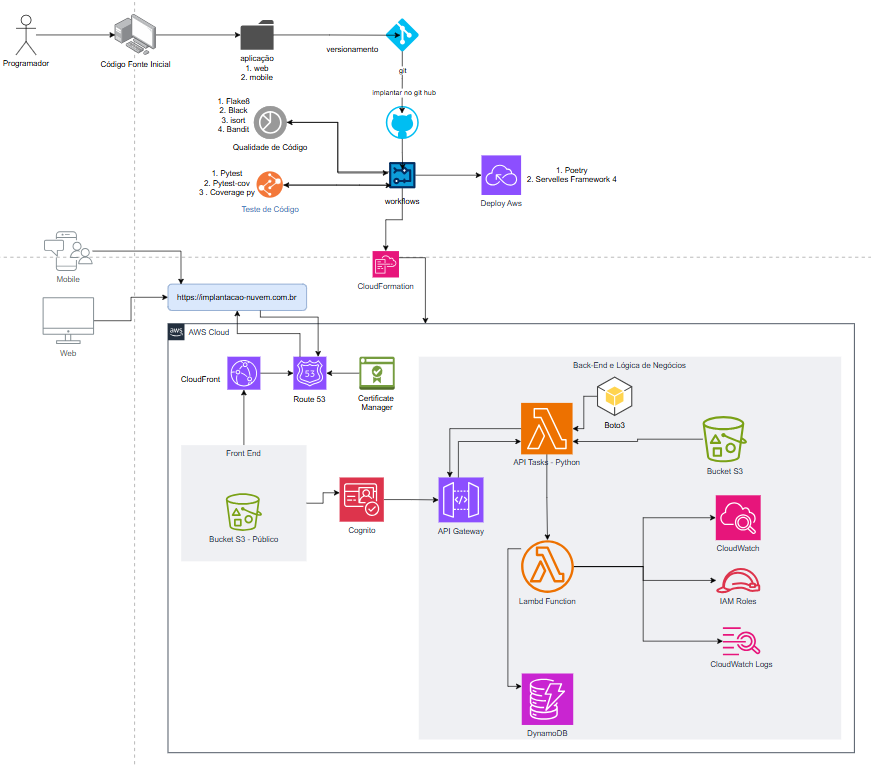
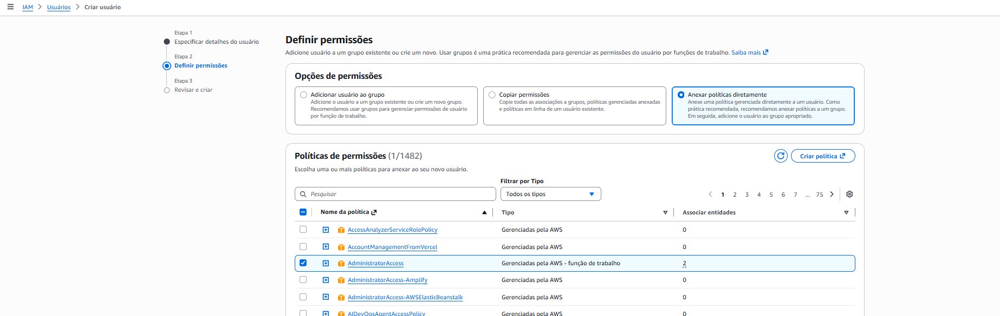
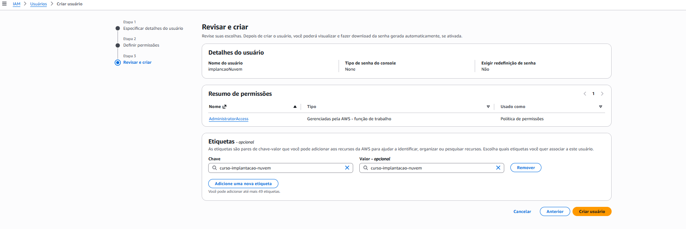
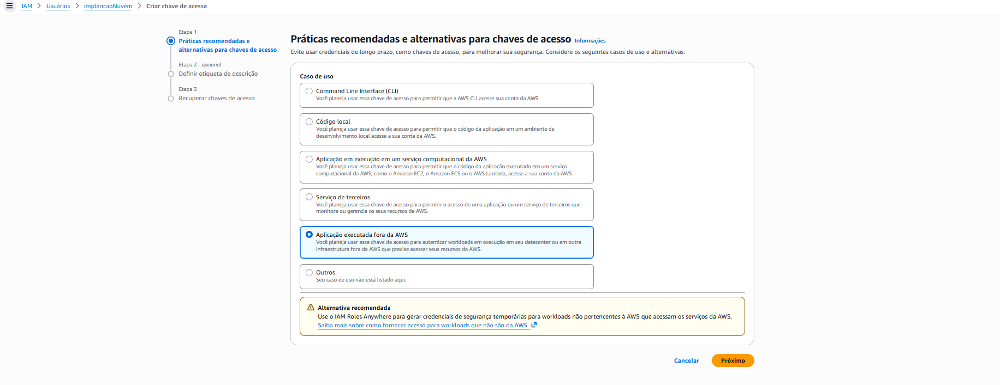
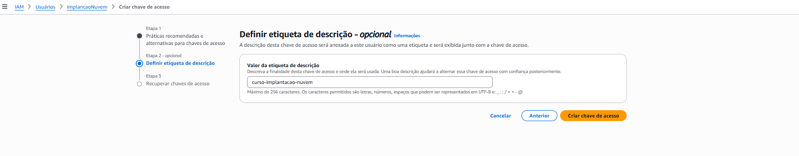
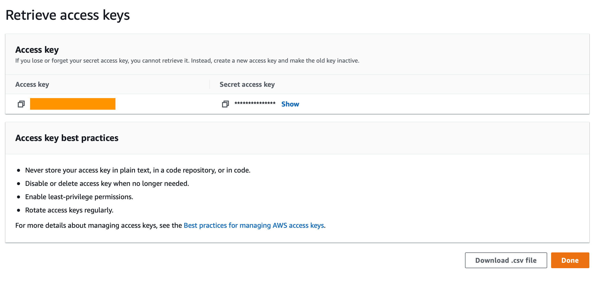
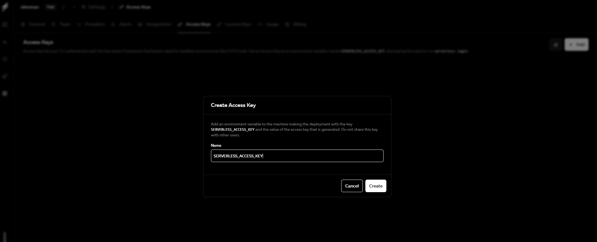
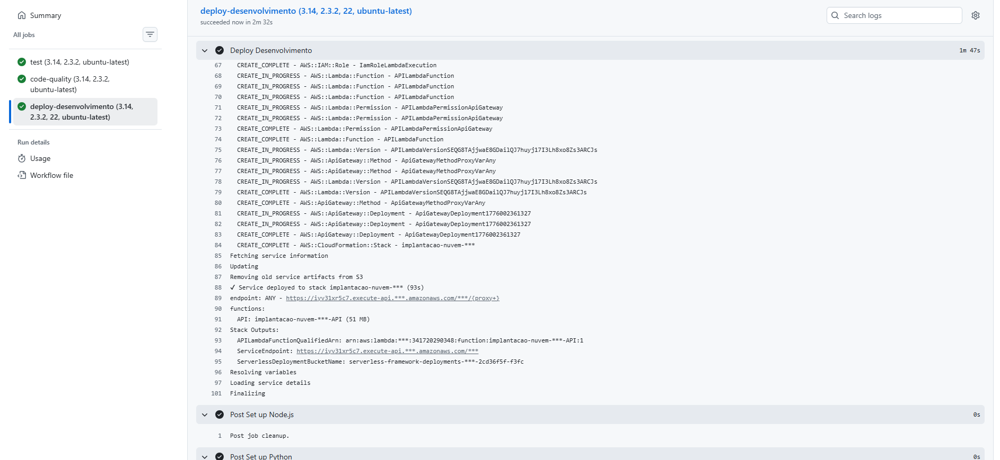

<<<<<<< HEAD
# Implantacao-nuvem

1. Criar o arquivo .gitignore na raiz do projeto  e adicionar as seguintes linhas:

```node_modules

.serverless

=======
# Documentação Implantação de Software Na nuvem

### Arquitetura da aplicação - Cloud Native


1. Criar o arquivo .gitignore na raiz do projeto e adicionar as seguintes linhas:

```node_modules
.serverless
>>>>>>> 9a8989c (implementação nuve)
```

2. Monorepo, com os seguintes diretórios:

.github
infrastructure
services

<<<<<<< HEAD
3. Dentro do diretório .github, criar o diretório workflows e adicionar o arquivo api.yml com os seguinte conteúdo:
=======
3. Dentro do diretório .github, criar o diretório workflows

4. Configurar o poetry no seu computador, seguindo as instruções da documentação oficial: https://python-poetry.org/docs/#installation


5. Dentro de services, criar um diretório para cada serviço, por exemplo: service1, service2, etc.

5.1 Crie o ditorio tasks_api e dentro dele rode o poetry init para criar o arquivo pyproject.toml

5.2 Instale as dependências necessárias para o serviço, por exemplo:

```poetry add --dev pytest-cov black isort flake8 bandit```

5.3 Para desisntalar uma dependência, use o comando:

```poetry remove <nome-da-dependencia>```

5.4 Agora vamos instalar as dependências de produção:

```poetry add fastapi uvicorn httpx```

6. Dentro de tasks_api crie o arquivo main.py e tests.py

6.1 Com foco no TDD, vamos começar escrevendo os testes antes de implementar a funcionalidade. No arquivo tests.py, adicione o seguinte código para testar a criação de uma tarefa:

```python
import pytest
from fastapi import status
from starlette.testclient import TestClient

from main import app


@pytest.fixture
def client():
    return TestClient(app)


def test_health_check(client):
    """
    GIVEN
    WHEN health check endpoint is called with GET method
    THEN response with status 200 and body OK is returned
    """
    response = client.get("/api/health-check/")
    assert response.status_code == status.HTTP_200_OK
    assert response.json() == {"message": "OK"}
```

6.1.1 - Vamos rodar o comando para rodar os testes:

```poetry run pytest tests.py```

6.1.1.1 - O teste deve falhar, pois ainda não implementamos a funcionalidade. Agora vamos implementar a funcionalidade no arquivo main.py:

```python
    from main import app
E   ModuleNotFoundError: No module named 'main'
```
6.1.2 - Em seguida, crie um novo arquivo chamado main.py dentro de "services/tasks_api":

```python
from fastapi import FastAPI
from fastapi.middleware.cors import CORSMiddleware

app = FastAPI()
app.add_middleware(
    CORSMiddleware,
    allow_origins="*",
    allow_credentials=True,
    allow_methods=["*"],
    allow_headers=["*"],
)


@app.get("/api/health-check/")
def health_check():
    return {"message": "OK"}
```

6.1.2.1 - Agora, vamos rodar novamente os testes:

```poetry run pytest tests.py```

6.1.2.2 - O teste deve passar, indicando que a funcionalidade foi implementada corretamente. É isso. Simples assim. Basta retornar {"message": "OK"}.

6.1.3 - Agora, vamos rodar o serviço localmente para verificar se está funcionando corretamente:

```poetry run uvicorn main:app --reload```

7. Agora, vamos configurar o GitHub Actions para automatizar o processo de teste e implantação. Dentro do diretório .github/workflows, crie um arquivo chamado api.yml com o seguinte conteúdo:

7.1 - Se o python estiver na versão 3.12, o código do workflow deve ser o seguinte: 
```yaml
name: API Test and deploy
on:
  push:
    paths:
      - 'services/tasks_api/**'
      - '.github/workflows/api.yml'

jobs:
  code-quality:
    strategy:
      fail-fast: false
      matrix:
        python-version: [3.9]
        poetry-version: [1.3.2]
        os: [ubuntu-latest]
    runs-on: ${{ matrix.os }}
    defaults:
      run:
        working-directory: services/tasks_api
    steps:
      - uses: actions/checkout@v3
      - uses: actions/setup-python@v3
        with:
          python-version: ${{ matrix.python-version }}
      - name: Install poetry
        uses: abatilo/actions-poetry@v2.0.0
        with:
          poetry-version: ${{ matrix.poetry-version }}
      - name: Install dependencies
        run: poetry install --no-root
      - name: Run black
        run: poetry run black . --check
      - name: Run isort
        run: poetry run isort . --check-only
      - name: Run flake8
        run: poetry run flake8 .
      - name: Run bandit
        run: poetry run bandit .
```

7.2 - Se o python estiver na versão 3.14, o código do workflow deve ser o seguinte: 
```yaml
name: API Test and deploy
on:
  push:
    paths:
      - 'services/tasks_api/**'
      - '.github/workflows/api.yml'

jobs:
  code-quality:
    strategy:
      fail-fast: false
      matrix:
        python-version: [3.14]
        poetry-version: [2.3.2]
        os: [ubuntu-latest]
    runs-on: ${{ matrix.os }}
    defaults:
      run:
        working-directory: services/tasks_api
    steps:
      - name: Checkout code
        uses: actions/checkout@v4

      - name: Set up Python
        uses: actions/setup-python@v5
        with:
          python-version: ${{ matrix.python-version }}

      - name: Install Poetry
        run: pip install "poetry>=2.1,<3" poetry-plugin-export

      - name: Install dependencies
        run: poetry install --no-root

      - name: Run black (autoformat)
        run: poetry run black .

      - name: Run isort (autoformat)
        run: poetry run isort . --profile black

      - name: Run flake8
        run: poetry run flake8 .

      - name: Run bandit
        run: poetry run bandit .
```

7.3 - Agora, sempre que você fizer um push para o repositório, o workflow será acionado e os testes de qualidade de código serão executados automaticamente. Se algum teste falhar, você receberá uma notificação para corrigir os problemas antes de prosseguir com a implantação.

7.4 - Para implantar o serviço na nuvem, você pode usar uma plataforma como AWS, Azure ou Google Cloud. Cada plataforma tem suas próprias ferramentas e processos de implantação, então você precisará seguir as instruções específicas para a plataforma que escolher. Em geral, o processo envolverá a criação de uma instância de servidor, a configuração do ambiente de execução e a implantação do código do serviço.

7.5 - Vamos configurar o arquivo .flak8 para definir as regras de linting para o projeto. Crie um arquivo chamado .flake8 na raiz do projeto tasks_api com o seguinte conteúdo:

```ini
[flake8]
max-line-length = 120
exclude =
    .git,
    build,
    dist,
    .venv
max-complexity = 10
docstring_style=sphinx
```

7.5.1 - Essa configuração garante que o código formatado com Black passe pela verificação de código do Flake8.

7.5.2 - Vamos rodar os seguintes comandos para verificar se o código está formatado corretamente e se não há problemas de linting:

```
poetry run black .
poetry run isort . --profile black
poetry run flake8 .
poetry run bandit .
```

7.6 - Agora vamos montar o job de testes e implantação para o serviço de tasks_api. Crie um arquivo chamado tasks_api.yml dentro do diretório .github/workflows/api.yml antes do job code-quality com o seguinte conteúdo:

7.6.1 - Se o python estiver na versão 3.12, o código do workflow deve ser o seguinte: 
```yaml
  test:
    strategy:
      fail-fast: false
      matrix:
        python-version: [3.9]
        poetry-version: [1.3.2]
        os: [ubuntu-latest]
    runs-on: ${{ matrix.os }}
    defaults:
      run:
        working-directory: services/tasks_api
    steps:
      - uses: actions/checkout@v3
      - uses: actions/setup-python@v3
        with:
          python-version: ${{ matrix.python-version }}
      - name: Install poetry
        uses: abatilo/actions-poetry@v2.0.0
        with:
          poetry-version: ${{ matrix.poetry-version }}
      - name: Install dependencies
        run: poetry install --no-root
      - name: Run tests
        run: poetry run pytest tests.py --cov=./ --cov-report=xml
      - name: Upload coverage to Codecov
        uses: codecov/codecov-action@v3
        with:
          token: ${{ secrets.CODECOV_TOKEN }}
  code-quality:
```

7.6.2 - Se o python estiver na versão 3.14, o código do workflow deve ser o seguinte: 
```yaml
  test:
    strategy:
      fail-fast: false
      matrix:
        python-version: [3.14]
        poetry-version: [2.3.2]
        os: [ubuntu-latest]
    runs-on: ${{ matrix.os }}
    defaults:
      run:
        working-directory: services/tasks_api
    steps:
      - name: Checkout code
        uses: actions/checkout@v4

      - name: Set up Python
        uses: actions/setup-python@v5
        with:
          python-version: ${{ matrix.python-version }}

      - name: Install Poetry
        run: pip install "poetry>=2.1,<3" poetry-plugin-export

      - name: Install dependencies
        run: poetry install --no-root

      - name: Run tests
        run: poetry run pytest tests.py --cov=./ --cov-report=xml

      - name: Upload coverage to Codecov
        uses: codecov/codecov-action@v3
        with:
          token: ${{ secrets.CODECOV_TOKEN }}
  code-quality:
```

7.6.3 - Estamos usando o CODECOV_TOKEN para enviar os relatórios de cobertura de teste para o Codecov (http://codecov.io/), que é uma plataforma de análise de cobertura de código. Você precisará criar uma conta no Codecov e obter um token de acesso para usar essa funcionalidade. O token deve ser adicionado como um segredo no repositório do GitHub para garantir que ele seja mantido seguro.

7.6.3.1 - Acesse https://docs.codecov.com/docs/quick-start para obter o token de acesso do Codecov.

7.6.4 - Precisamos fazer o seguinte caminho dentro do repositório no gitHub, acesse Settings > Secrets and variables > Actions > New repository secret e adicione o nome do segredo como CODECOV_TOKEN e o valor como o token de acesso que você obteve do Codecov.

7.7. Agora, sempre que você fizer um push para o repositório, o workflow será acionado e os testes serão executados automaticamente. Se algum teste falhar, você receberá uma notificação para corrigir os problemas antes de prosseguir com a implantação. Se todos os testes passarem, o relatório de cobertura de teste será enviado para o Codecov, onde você poderá analisar a cobertura do código e identificar áreas que precisam de mais testes.


8. Implantação Serverless

8.1 - Vamos adicionar o Mangum para permitir que o serviço seja executado em um ambiente serverless, como AWS Lambda. Instale o Mangum usando o Poetry:

```poetry add mangum```

8.1.1 - Em seguida, modifique o arquivo main.py para incluir o handler do Mangum:

```pythonc
from fastapi import FastAPI
from fastapi.middleware.cors import CORSMiddleware
from mangum import Mangum

app = FastAPI()

app.add_middleware(
    CORSMiddleware,
    allow_origins="*",
    allow_credentials=True,
    allow_methods=["*"],
    allow_headers=["*"],
)


@app.get("/api/health-check/")
def health_check():
    return {"message": "OK"}


handle = Mangum(app)
```

8.1.2 - O handler do Mangum é criado usando a função Mangum, que recebe a instância do FastAPI como argumento. Isso permite que o serviço seja executado em um ambiente serverless, como AWS Lambda, sem a necessidade de configurar um servidor web tradicional. O handler do Mangum é responsável por converter as solicitações HTTP recebidas em eventos compatíveis com o AWS Lambda e retornar as respostas apropriadas. Para informações mais detalhadas sobre o Mangum, consulte a documentação oficial: https://mangum.io/integrating-asgi-with-aws-lambda-for-serverless-applications/


8.2 - Para implantar nossa aplicação, usaremos o Serverless Framework , que facilita o desenvolvimento e a implantação de aplicações serverless. Diferentemente do Django ou do FastAPI, não o utilizamos diretamente no código Python. O que precisamos fazer é criar um arquivo de configuração `serverless.yml` que informa ao Serverless Framework quais recursos de nuvem serverless devem ser criados e como invocar nossa aplicação em execução neles. O framework é compatível com diversos provedores de nuvem , como AWS , Google Cloud e Azure , entre outros. Este curso utiliza a AWS. Para mais informações sobre o Serverless Framework, consulte a documentação oficial: https://www.serverless.com/framework/docs/

8.2.1 - Dentro do diretório tasks_api, crie um arquivo chamado serverless.yml com o seguinte conteúdo:

```yaml
    service: implantacao-nuvem

    frameworkVersion: '4'
    useDotenv: true


    provider:
      name: aws
      runtime: python3.14
      region: ${opt:region, 'sa-east-1'}
      stage: ${opt:stage, 'desenvolvimento'}
      logRetentionInDays: 90
      environment:
        APP_ENVIRONMENT: ${self:provider.stage}

    functions:
      API:
        handler: main.handle
        timeout: 10
        memorySize: 512
        events:
          - http:
              path: /{proxy+}
              method: any
              cors:
                origin: ${env:ALLOWED_ORIGINS}
                maxAge: 60

    custom:
      pythonRequirements:
        usePoetry: true
        noDeploy:
          - boto3  # necessário para desenvolvimento local, mas já presente no ambiente Lambda
          - botocore  # necessário para desenvolvimento local, mas já presente no ambiente Lambda

    plugins:
      - serverless-python-requirements
```
8.2.2 - É altamente recomendável que você faça o tutorial básico "Seu Primeiro Projeto com Serverless Framework: https://www.serverless.com/framework/docs/tutorial" antes de prosseguir com este curso, para que você tenha algum contexto sobre como o Serverless Framework funciona.

8.2.3 - Crie um arquivo .env na raiz do projeto tasks_api e adicione a seguinte linha:

```ALLOWED_ORIGINS=*```

8.2.4 - Crie um arquivo chamado package.json na raiz do projeto tasks_api com o seguinte conteúdo:

```json
{
  "name": "tasks_api",
  "version": "1.0.0",
  "description": "",
  "main": "index.js",
  "scripts": {
    "test": "echo \"Error: no test specified\" && exit 1"
  },
  "author": "",
  "license": "ISC",
  "dependencies": {
    "serverless-python-requirements": "^5.1.1"
  }
}
```

Porque, o Serverless Framework é escrito em JavaScript. Ele requer o Node.js para funcionar e, como todos os plugins são escritos em JavaScript, é necessário usar o npm para instalá-los.

8.2.5 - Agora, vamos instalar o Serverless Framework globalmente usando o npm:

```npm install -g serverless```

8.2.6 - Para implantar o serviço na AWS, você precisará configurar suas credenciais da AWS usando o AWS CLI. Siga as instruções da documentação oficial para configurar suas credenciais: https://docs.aws.amazon.com/cli/latest/userguide/cli-configure-quickstart.html

8.2.7 - Agora, você pode implantar o serviço usando o seguinte comando:

```serverless deploy```

8.2.8 - O comando `serverless deploy` irá empacotar o código do serviço, criar os recursos necessários na AWS e implantar a aplicação. Após a implantação, você receberá uma URL de endpoint que pode ser usada para acessar o serviço.

8.2.9 - Para verificar se o serviço está funcionando corretamente, você pode fazer uma solicitação HTTP para o endpoint usando uma ferramenta como curl ou Postman:

```curl https://<your-endpoint-url>/api/health-check/```

8.2.10 - Se tudo estiver configurado corretamente, você deve receber uma resposta com o status 200 e o corpo {"message": "OK"}, indicando que o serviço está funcionando corretamente na AWS Lambda.

9. Pipelines de CI/CD

9.1 - Para configurar um pipeline de CI/CD para o serviço de tasks_api, você pode usar uma ferramenta como AWS CodePipeline, GitHub Actions ou Jenkins. Neste curso, usaremos o GitHub Actions para criar um pipeline de CI/CD que automatiza o processo de teste e implantação do serviço.

9.2 - Com a configuração Serverless pronta, agora precisamos configurar o pipeline CI/CD para implantar a aplicação.

Adicione um novo trabalho chamado deploy-desenvolvimento as variáveis ​​de ambiente apropriadas ao arquivo .github/workflows/api.yml :

9.2.1 - Vamos adicionar:

```
env:
env:
  AWS_ACCESS_KEY_ID: ${{ secrets.AWS_ACCESS_KEY_ID }}
  AWS_SECRET_ACCESS_KEY: ${{ secrets.AWS_SECRET_ACCESS_KEY }}
  SERVERLESS_ACCESS_KEY: ${{ secrets.SERVERLESS_ACCESS_KEY }}
```

9.2.2 - Após vamos adicionar as seguintes etapas para criar o arquivo .env.desenvolvimento e implantar a aplicação:

```yaml
  deploy-desenvolvimento:
    needs: [ test, code-quality ]
    strategy:
      fail-fast: false
      matrix:
        python-version: [3.14]
        poetry-version: [2.3.2]
        node-version: [22]
        os: [ubuntu-latest]
    runs-on: ${{ matrix.os }}
    defaults:
      run:
        working-directory: services/tasks_api
    steps:
      - name: Checkout Code
        uses: actions/checkout@v4

      - name: Set up Python
        uses: actions/setup-python@v5
        with:
          python-version: ${{ matrix.python-version }}

      - name: Install Poetry
        run: pip install "poetry>=2.1,<3" poetry-plugin-export

      - name: Set up Node.js
        uses: actions/setup-node@v4
        with:
          node-version: ${{ matrix.node-version }}

      - name: Install Serverless Framework
        run: npm install -g serverless

      - name: Install NPM dependencies
        run: npm install

      - name: Create .env.desenvolvimento file
        run: |
          cat <<EOF > .env.desenvolvimento
          APP_ENVIRONMENT=${{ secrets.STAGE_DEV }}
          AWS_DEFAULT_REGION=${{ secrets.REGION }}
          ALLOWED_ORIGINS=${{ secrets.ALLOWED_ORIGINS_DEV }}
          EOF
        working-directory: services/tasks_api

      - name: Deploy to Desenvolvimento
        env:
          STAGE: ${{ secrets.STAGE_DEV }}
          REGION: ${{ secrets.REGION }}
        run: sls deploy --stage $STAGE --region $REGION --verbose
```

9.2.3 - Certifique-se de adicionar as seguintes variáveis ​​de ambiente como segredos no repositório do GitHub:
- AWS_ACCESS_KEY_ID
- AWS_SECRET_ACCESS_KEY
- SERVERLESS_ACCESS_KEY
- STAGE_DEV
- REGION
- ALLOWED_ORIGINS_DEV

9.2.4 - Agora, sempre que você fizer um push para o repositório, o workflow será acionado e os testes serão executados automaticamente. Se todos os testes passarem, a aplicação será implantada na AWS Lambda usando o Serverless Framework. Você pode verificar a implantação acessando o console da AWS Lambda e verificando se a função foi criada corretamente.

9.2.5 - Crie uma branch de desenvolvimento chamada desenvolvimento e faça um push para essa branch para acionar o workflow de implantação:

```git checkout -b desenvolvimento

9.2.6 - Agora, sempre que você fizer um push para a branch desenvolvimento, o workflow será acionado e a aplicação será implantada na AWS Lambda usando o Serverless Framework. Você pode verificar a implantação acessando o console da AWS Lambda e verificando se a função foi criada corretamente.
```

9.2.7 - Para verificar se o serviço está funcionando corretamente, você pode fazer uma solicitação HTTP para o endpoint usando uma ferramenta como curl ou Postman:

```curl https://<your-endpoint-url>/api/health-check/```

9.2.8 - Coloque o on push para executar apenas no ambiente de desenvolvimento, ou seja, na branch desenvolvimento. Para isso, modifique o gatilho do workflow no arquivo .github/workflows/api.yml para o seguinte:

```yaml
on:
  push:
    branches:
      - desenvolvimento 
```

9.2.9 - O Workflow ficará assim:

```yaml
name: Deploy API Desenvolvimento
on:
  push:
    branches: 
      - desenvolvimento
    paths:
      - 'services/tasks_api/**'
      - '.github/workflows/api.yml'

env:
  AWS_ACCESS_KEY_ID: ${{ secrets.AWS_ACCESS_KEY_ID }}
  AWS_SECRET_ACCESS_KEY: ${{ secrets.AWS_SECRET_ACCESS_KEY }}
  SERVERLESS_ACCESS_KEY: ${{ secrets.SERVERLESS_ACCESS_KEY }}
  
jobs: 
  test:
    strategy:
      fail-fast: false
      matrix:
        python-version: [3.14]
        poetry-version: [2.3.2]
        os: [ubuntu-latest]
    runs-on: ${{ matrix.os }}
    defaults:
      run:
        working-directory: services/tasks_api
    steps:
      - name: Checkout code
        uses: actions/checkout@v4

      - name: Set up Python
        uses: actions/setup-python@v5
        with:
          python-version: ${{ matrix.python-version }}

      - name: Install Poetry
        run: pip install "poetry>=2.1,<3" poetry-plugin-export

      - name: Install dependencies
        run: poetry install --no-root

      - name: Run tests
        run: poetry run pytest tests.py --cov=./ --cov-report=xml

      - name: Upload coverage to Codecov
        uses: codecov/codecov-action@v3
        with:
          token: ${{ secrets.CODECOV_TOKEN }}
  code-quality:
    strategy:
      fail-fast: false
      matrix:
        python-version: [3.14]
        poetry-version: [2.3.2]
        os: [ubuntu-latest]
    runs-on: ${{ matrix.os }}
    defaults:
      run:
        working-directory: services/tasks_api
    steps:
      - name: Checkout code
        uses: actions/checkout@v4

      - name: Set up Python
        uses: actions/setup-python@v5
        with:
          python-version: ${{ matrix.python-version }}

      - name: Install Poetry
        run: pip install "poetry>=2.1,<3" poetry-plugin-export

      - name: Install dependencies
        run: poetry install --no-root

      - name: Run black (autoformat)
        run: poetry run black .

      - name: Run isort (autoformat)
        run: poetry run isort . --profile black

      - name: Run flake8
        run: poetry run flake8 .

      - name: Run bandit
        run: poetry run bandit .

  deploy-desenvolvimento:
    needs: [ test, code-quality ]
    strategy:
      fail-fast: false
      matrix:
        python-version: [3.14]
        poetry-version: [2.3.2]
        node-version: [22]
        os: [ubuntu-latest]
    runs-on: ${{ matrix.os }}
    defaults:
      run:
        working-directory: services/tasks_api
    steps:
      - name: Checkout Code
        uses: actions/checkout@v4

      - name: Set up Python
        uses: actions/setup-python@v5
        with:
          python-version: ${{ matrix.python-version }}

      - name: Install Poetry
        run: pip install "poetry>=2.1,<3" poetry-plugin-export

      - name: Set up Node.js
        uses: actions/setup-node@v4
        with:
          node-version: ${{ matrix.node-version }}

      - name: Install Serverless Framework
        run: npm install -g serverless

      - name: Install NPM dependencies
        run: npm install

      - name: Create .env.desenvolvimento file
        run: |
          cat <<EOF > .env.desenvolvimento
          APP_ENVIRONMENT=${{ secrets.STAGE_DEV }}
          AWS_DEFAULT_REGION=${{ secrets.REGION }}
          ALLOWED_ORIGINS=${{ secrets.ALLOWED_ORIGINS_DEV }}
          EOF
        working-directory: services/tasks_api

      - name: Deploy to Desenvolvimento
        env:
          STAGE: ${{ secrets.STAGE_DEV }}
          REGION: ${{ secrets.REGION }}
        run: sls deploy --stage $STAGE --region $REGION --verbose
```

9.2.10 -Na nova tarefa adicionada, deploy-desenvolvimento , fazemos o seguinte:

1. Primeiro, preparamos o ambiente básico instalando Python, Poetry e Node.
2. Em segundo lugar, instalamos o Serverless como uma dependência global, o que nos permite executar slscomandos.
3. Em terceiro lugar, instalamos as dependências do package.json -- neste ponto, só falta o serverless-python-requirementsplugin.
4. Por último, mas não menos importante, implantamos nossos aplicativos executando o sls deploy --stage desenvolvimento --verbosecomando. Adicionamos a --verboseopção de exibir as saídas (por exemplo, URL do API Gateway, etc.).

"Você pode tentar fazer o deploy diretamente do seu computador para a AWS executando npm installo comando serverless deploy --stage desenvolvimento dentro de "services/tasks_api". Você precisa ter o Serverless Framework instalado , assim como o npm e o Node.js. Você também precisa configurar suas credenciais da AWS."

10. Credenciais da AWS

Antes de poder confirmar e enviar as alterações, você precisará adicionar as credenciais da AWS ao GitHub. Se você ainda não tem uma conta da AWS, crie uma no console da AWS: https://aws.amazon.com/console/ .

10.1 - Primeiro, abra o console do IAM . Em seguida, clique em "Adicionar usuário: https://us-east-1.console.aws.amazon.com/iam/home?region=us-east-1#/users". Digite " github " como nome de usuário. Clique em "Avançar".


10.2 - Na próxima etapa, selecione "Anexar políticas diretamente" e selecione "Acesso de administrador".



10.2.1 Nessa etapa crie uma etiqueta para o usuário, por exemplo, "github" e clique em "Avançar".




10.3 - Clique em "Avançar" e depois em "Criar usuário". Assim que o usuário for criado (você o verá na lista de usuários), clique nele para abrir os detalhes. Em seguida, acesse a guia "Credenciais de segurança" e clique em "Criar chave de acesso".

10.3.1 - Em seguida, selecione "Aplicativo em execução fora da AWS" e clique em "Avançar". Na tela seguinte, clique em "Criar chave de acesso".





10.3.2 - Agora, você verá a chave de acesso e a chave secreta. Copie ambas as chaves e adicione-as como segredos no repositório do GitHub, conforme descrito na etapa 9.2.3. Depois de obter as credenciais do seu usuário IAM do GitHub , você precisa adicioná-las ao GitHub. Para isso, acesse seu repositório e clique em "Configurações" -> "Segredos e variáveis" -> "Ações". Em seguida, clique em "Novo segredo do repositório". Defina as chaves `<credentials>` AWS_ACCESS_KEY_IDe ` AWS_SECRET_ACCESS_KEY<secrets>` com os valores das credenciais que você acabou de criar.



10.4 - Entre do servelless framework clique em setings > Access Keys > Create Access Key. Copie a chave de acesso e adicione-a como segredo no repositório do GitHub, conforme descrito na etapa 9.2.3.



10.5 Com tudo vamos pronto para o deploy. Faça um push para a branch desenvolvimento para acionar o workflow de implantação:

```git checkout -b desenvolvimento

git add .
git commit -m "Configuração do pipeline de CI/CD para implantação na AWS Lambda usando Serverless Framework"
git push origin desenvolvimento
```

10.6 - Dentro da pipeline de CI/CD, você verá as etapas sendo executadas. Se tudo estiver configurado corretamente, a aplicação será implantada na AWS Lambda usando o Serverless Framework. Você pode verificar a implantação acessando o console da AWS Lambda e verificando se a função foi criada corretamente.



10.6.1 - Para verificar se o serviço está funcionando corretamente, você pode fazer uma solicitação HTTP para o endpoint usando uma ferramenta como curl ou Postman:

```curl https://<your-endpoint-url>/api/health-check/```
>>>>>>> 9a8989c (implementação nuve)
